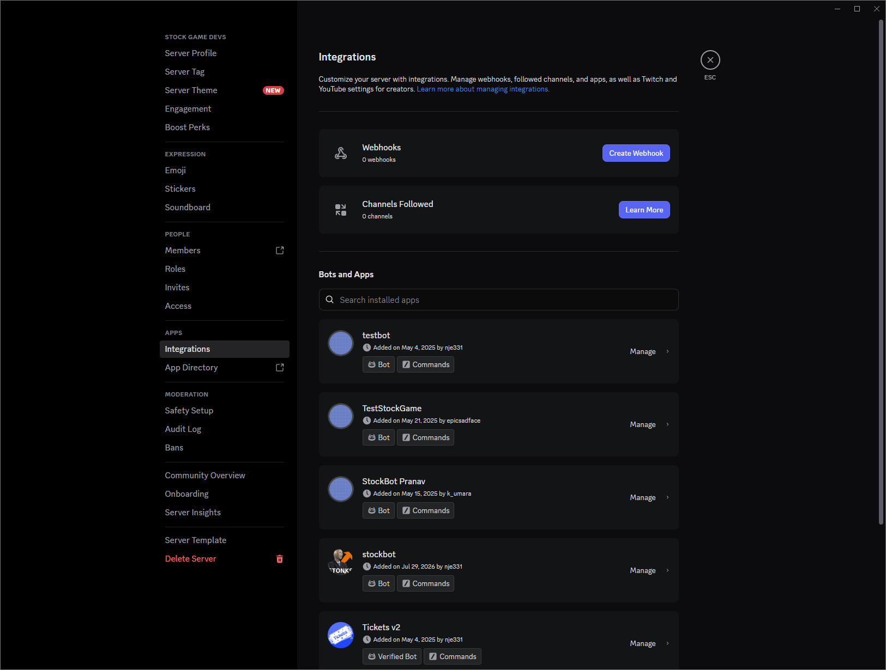
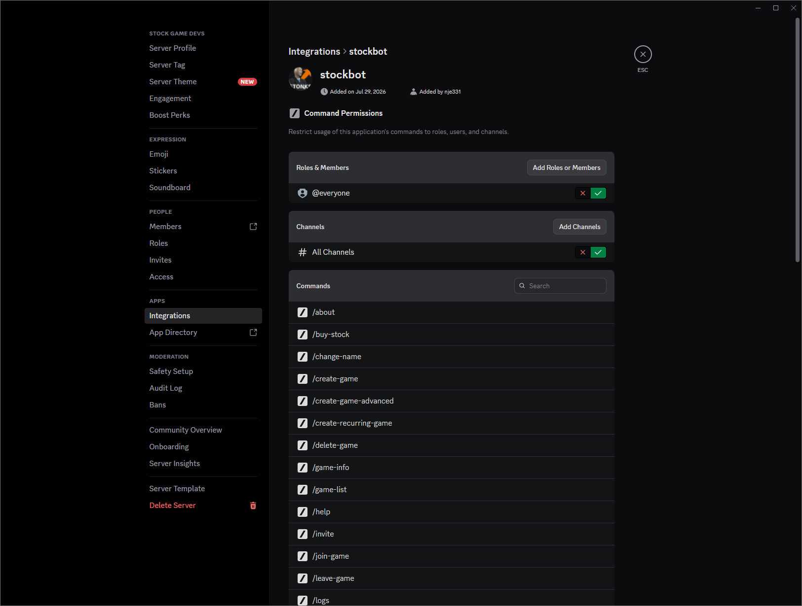
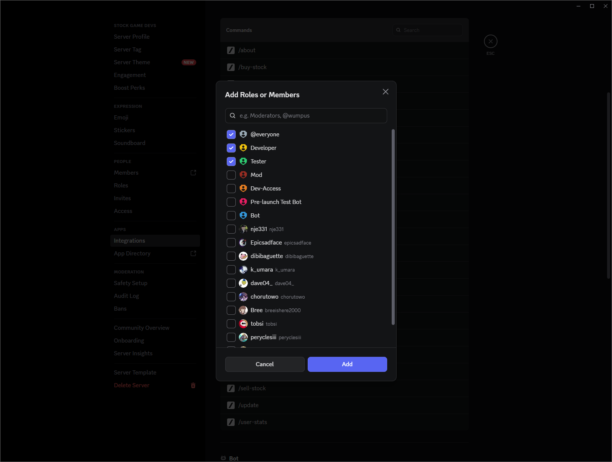
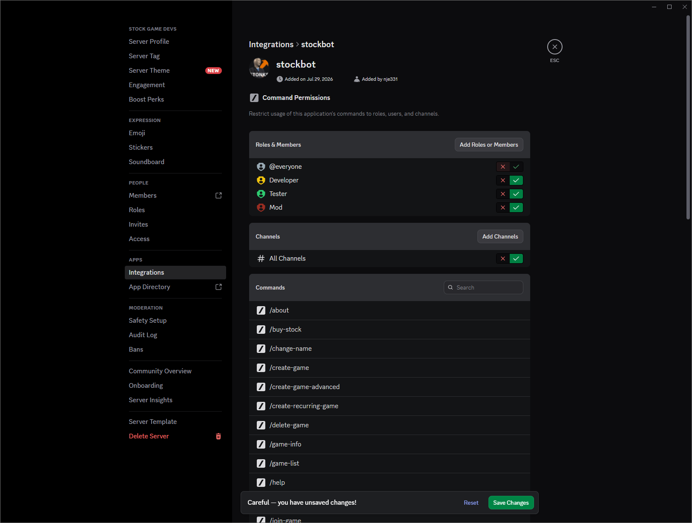
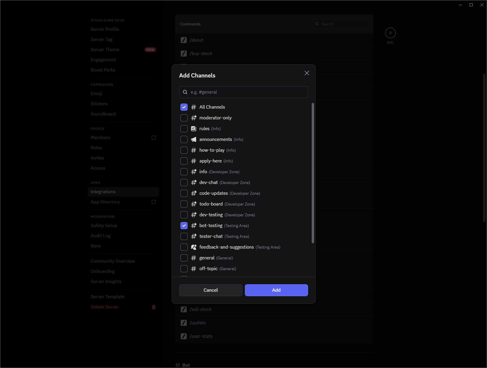
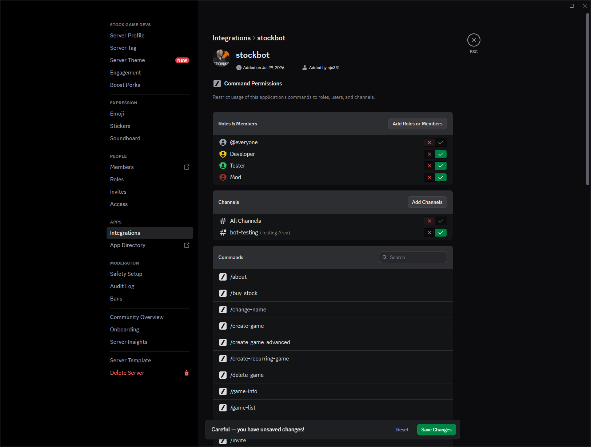
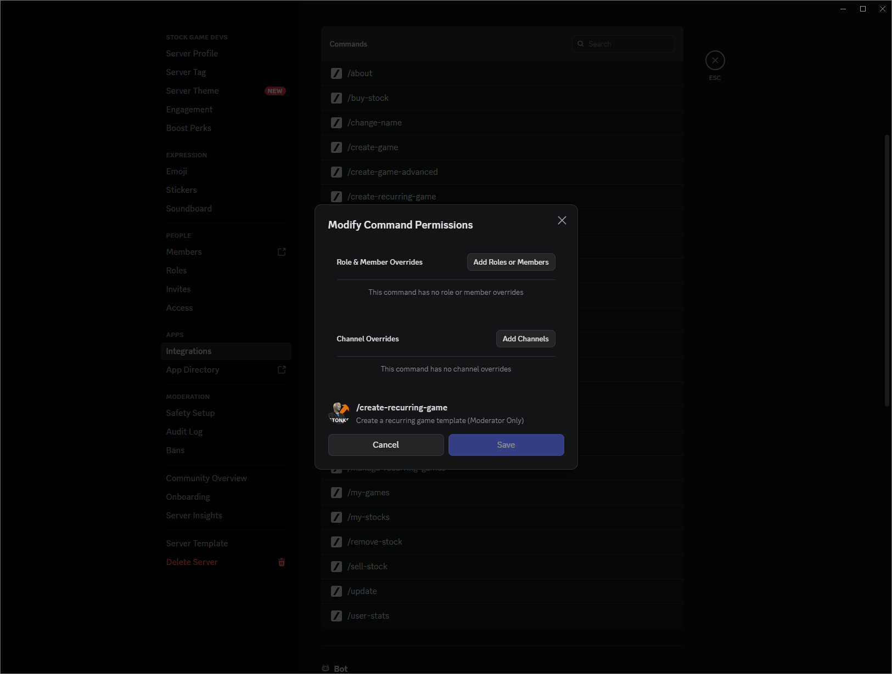
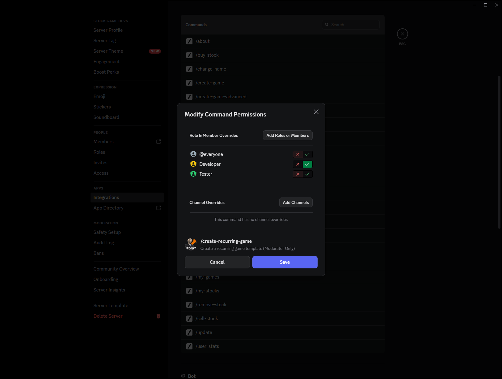
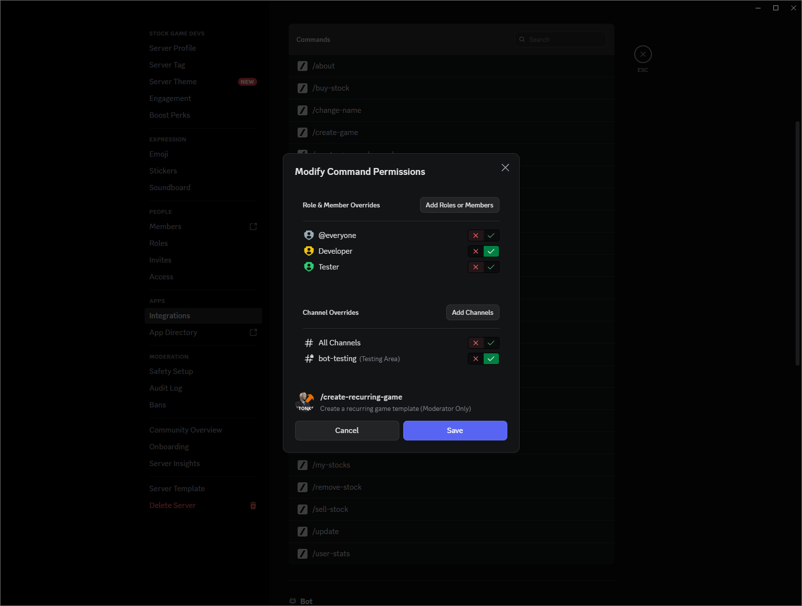
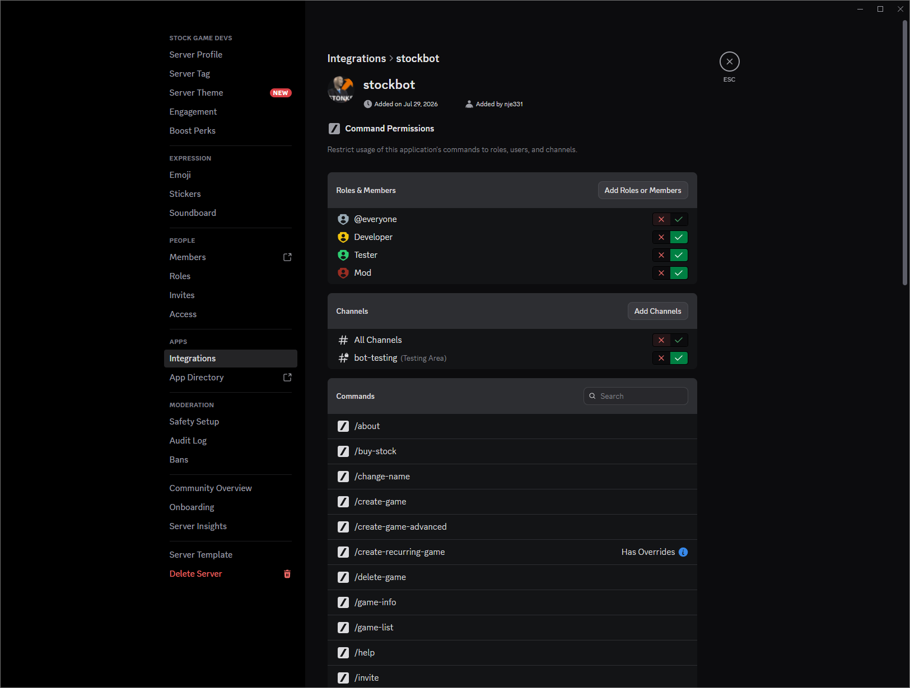

# Discord Integrations

How to control **who** can use Stock Game slash commands and **where** they appear, using Discord’s server **Integrations** settings.

You need **Manage Server** (or equivalent) permission. This is separate from creating the bot in the [Developer Portal](Discord-Bot-Setup) — do that first, then invite the bot, then configure integrations here.

## Open Integrations

1. Open your Discord server.
2. Click the server name → **Server Settings**.
3. Under **apps**, open **Integrations**.
4. Find your Stock Game bot in **Bots and Apps** and click **Manage**.

On the bot page you will see:

- **Command Permissions** — defaults for **all** commands (roles/members and channels)
- **Commands** — each slash command; click one to set **per-command** overrides

Discord’s toggles mean:

| Control | Meaning |
|---------|---------|
| Red **X** | Denied / disabled for that role, member, or channel |
| Green **check** | Allowed / enabled |

**Tip:** Deny broad defaults (`@everyone`, `# All Channels`), then allow only the roles and channels you want. Clearer and safer than leaving everything open.

---

## Option A — Bot-wide permissions (all commands)

Use this when most commands should share the same audience and channels (for example: only Developer / Tester / Mod, only in `#bot-testing`).

### 1. Restrict roles

1. Under **Roles & Members**, click **Add Roles or Members**.
2. Select the roles (and optionally users) you care about, then **Add**.

3. Set **`@everyone`** to the red **X** (deny).
4. Set your staff roles (e.g. Developer, Tester, Mod) to the green check.

### 2. Restrict channels

1. Under **Channels**, click **Add Channels**.
2. Select **All Channels** (so you can deny the global default) and any channels where commands should work (e.g. `#bot-testing`), then **Add**.

3. Set **`# All Channels`** to the red **X**.
4. Set your allowed channel(s) to the green check.

### 3. Save

When the banner says **Careful — you have unsaved changes!**, click **Save Changes**.

After saving, members without an allowed role will not see / run the commands in disallowed channels. Allowed roles can use them in the channels you enabled.

---

## Option B — Per-command permissions

Use this when only some commands should be locked down (for example: `/create-recurring-game` for moderators in `#bot-testing`, while `/game-list` stays open).

### 1. Open a command

In the **Commands** list, click the command you want to restrict (example: `/create-recurring-game`).

### 2. Role overrides

1. Click **Add Roles or Members**, add `@everyone` plus the roles that should (or should not) use the command.
2. Deny **`@everyone`**, allow the roles that may run it (and deny others as needed).

### 3. Channel overrides

1. Click **Add Channels**, add **All Channels** plus the channel(s) where this command is allowed.
2. Deny **All Channels**, allow the specific channel(s).

### 4. Save the command modal

Click **Save** on the **Modify Command Permissions** dialog.

Commands with custom rules show **Has overrides** in the list:

You can still combine approaches: set sensible **bot-wide** defaults, then add **Has overrides** only on sensitive commands (`/create-recurring-game`, `/manage-recurring-games`, `/logs`, `/delete-game`, etc.).

---

## Suggested layouts

| Goal | Approach |
|------|----------|
| Dev / test server: only staff, only `#bot-testing` | Option A (bot-wide deny `@everyone` + All Channels; allow staff roles + `#bot-testing`) |
| Public play commands, locked admin tools | Option B on moderator commands; leave player commands at defaults or lightly restricted |
| One channel for all bot use | Bot-wide: deny All Channels, allow that channel |

Bot-side checks (e.g. “Moderator Only” in a command description) still apply. Integrations hide or block commands in Discord’s UI; they do not replace in-bot permission logic.

## Troubleshooting

| Problem | Things to try |
|---------|----------------|
| Nobody can see any commands | Bot-wide: you denied `@everyone` but forgot to allow any role; or denied All Channels without allowing a channel |
| Commands missing in one channel | That channel is denied (or All Channels denied without an allow override for it) |
| Staff still cannot use a command | Their role is denied on that command’s **Has overrides**; or they lack a role you allowed |
| Changes seem ignored | Confirm **Save Changes** / modal **Save**; reload Discord (`Ctrl+R` / `Cmd+R`) |
| Wrong bot edited | Integrations lists every app — open the Stock Game bot you actually run |

## Related

- [Discord Bot Setup](Discord-Bot-Setup) — create app, intents, invite, `OWNER`
- [Environment Variables](Environment-Variables)
